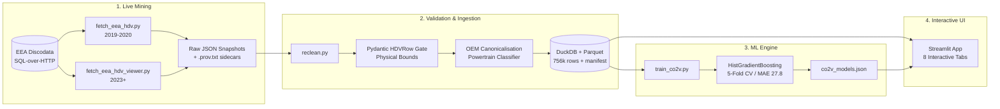

# 🚛 Competitive Powertrain Benchmarking Dashboard

EU heavy-duty vehicle (truck/bus) powertrain benchmarking and CO2 simulation platform for **Horse Powertrain**.

[](tests/)
[](pyproject.toml)
[](powerbench/dataio.py)
[](app/streamlit_app.py)
[](https://mohamed-soubhi.github.io/Competitive-Powertrain-Benchmarking/)

---

## 🌐 Online Demo & Deployment

- **Interactive GitHub Pages App**: [https://mohamed-soubhi.github.io/Competitive-Powertrain-Benchmarking/](https://mohamed-soubhi.github.io/Competitive-Powertrain-Benchmarking/)
- **Technical HTML Documentation**: [https://mohamed-soubhi.github.io/Competitive-Powertrain-Benchmarking/documentation.html](https://mohamed-soubhi.github.io/Competitive-Powertrain-Benchmarking/documentation.html)
- **Streamlit Community Cloud**: Deploy directly via `app/streamlit_app.py` or test the full pipeline locally.

---

## 📋 System Architecture



---

## 🚀 Application Tabs & Features

| Tab | Purpose | Key Visualizations / Controls |
|---|---|---|
| **① Pipeline** | Live mining & dataset orchestration | Multi-year buttons, single-year mining, Discodata live stream, no-network reload, retrain |
| **② Overview** | High-level fleet composition | Fleet volume metrics, powertrain breakdown, OEM representation, filtered data preview |
| **③ Distributions** | Fleet parameter spread | Nested subtabs: **Overall** (stacked histograms) & **By manufacturer** (per-OEM box plots) |
| **④ Correlations** | Engineering trade-off analysis | Pearson heatmap (identifies negative link between engine size and brake specific CO2) |
| **⑤ Benchmark** | OEM competitive ranking | Box plots (median + IQR whiskers), multi-year trend lines, relative Δ % ranking |
| **⑥ ML** | CO2v predictive modeling & what-if | Out-of-fold scatter, permutation feature importance, interactive parameter sliders |
| **⑦ Documentation** | Regulatory & platform reference | Embedded rich HTML technical documentation + one-click offline HTML export |
| **⑧ Provenance** | Auditability & data lineage | Cryptographic SHA-256 manifest, source table references, rejection counters |

---

## 🛠️ Setup & Quickstart

Managed with [`uv`](https://github.com/astral-sh/uv) (fast Python package and project manager):

```bash
# 1. Clone repository
git clone https://github.com/mohamed-soubhi/Competitive-Powertrain-Benchmarking.git
cd Competitive-Powertrain-Benchmarking

# 2. Sync dependencies (runtime + dev + streamlit)
uv sync --group app --group dev

# 3. Run complete test suite (82 offline tests)
uv run pytest -v

# 4. Launch the Streamlit dashboard
uv run streamlit run app/streamlit_app.py
```

> **Switching between Windows and WSL?** A `.venv` built under one OS breaks `uv`
> on the other — it fails on the `lib64` symlink with *"failed to remove file
> `.venv\lib64`: Access is denied (os error 5)"*. Fix: delete the `.venv` folder
> (`rd /s /q .venv` on Windows, `rm -rf .venv` on WSL) and re-run `uv sync`. The
> `run_app.bat` / `run_app.sh` launchers do this automatically before starting the app.

---

## ⛏️ Data Mining & Pipeline Commands

```bash
# Dry run: Inspect generated T-SQL queries without sending network requests
uv run python 1-mining/fetch_eea_hdv.py --dry-run -v

# Mine 2019–2020 VECTO data from Discodata
uv run python 1-mining/fetch_eea_hdv.py

# Mine 2023 pre-joined viewer table
uv run python 1-mining/fetch_eea_hdv_viewer.py

# Validate raw snapshots and build DuckDB + Parquet store
uv run python 2-pipeline/reclean.py

# Train and honestly evaluate CO2v regression models (5-Fold CV)
uv run python 3-ml-prediction/train_co2v.py
```

### 🔄 Refreshing to the latest available data

The EEA publishes HDV CO2 monitoring on **annual reporting periods** (1 July –
30 June) with a ~9–12 month lag, so there is always a 1–2 year gap. As of this
release Discodata's `latest` alias exposes **2019, 2020** (`CO2_HeavyDutyVehicles`)
and **2023** (`HDV_2023_viewer`); 2021–2022 live only in the bulk CSV.

When a new year is published, pick it up like this:

```bash
# 1. Probe whether the year has landed (0 rows / error = not yet published)
curl -s "https://discodata.eea.europa.eu/sql?nrOfHits=1&query=SELECT%20COUNT(*)%20n%20FROM%20%5BCO2Emission%5D.%5Blatest%5D.%5BHDV_2024_viewer%5D"

# 2. Add the year to 1-mining/config/sources.yaml
#    eea_hdv_viewer:  years: [2023, 2024]        # viewer-style years (>= 2023)
#    eea_hdv_co2:      years: [2019, 2020, ...]   # only if the base table gains years

# 3. Mine just the new year (older snapshots stay on disk and are reused)
uv run python 1-mining/fetch_eea_hdv_viewer.py --years 2024

# 4. Re-validate + reload (merges every hdv_co2_*.json and hdv_viewer_*.json) and retrain
uv run python 2-pipeline/reclean.py
uv run python 3-ml-prediction/train_co2v.py
```

Or from the app: **Pipeline** tab → set the years → **Full: mine → load → train**.

- `reclean.py` always merges **all** raw snapshots in `1-mining/data/raw/`. To
  rebuild from scratch (drop stale years), delete `1-mining/data/raw/*.json` first.
- The manifest (`1-mining/data/cleaned/manifest.json`) records every source
  snapshot + its SHA-256, so the active dataset is always auditable.
- Newer reporting years use a newer VECTO version than 2019–2020 — treat
  cross-year `CO2v` comparisons as directional.

---

## 🧠 Machine Learning Methodology

- **Target**: `CO2v` — VECTO declared specific CO2 emissions (g/km).
- **Target Leakage Guard**: Dynamometer test-cycle emissions (`WHTC_CO2_gkwh`, `WHSC_CO2_gkwh`), freight efficiency (`COL_CO2_gtkm`), and member state reported values (`MS_SpecificCO2Emissions`) are strictly banned from model inputs.
- **Evaluation**: Shuffled 5-fold cross-validation on 60,000 bounded subsamples:
  - **Rich Feature Set** (Mass + Class + Engine Specs, 2019–2020): **CV $R^2 = 0.595 \pm 0.006$**, **CV MAE = 27.8 g/km** (vs 49.4 median baseline).
  - **Base Feature Set** (Mass + Class + Powertrain, all years): **CV $R^2 = 0.448 \pm 0.018$**, **CV MAE = 45.2 g/km** (vs 62.2 median baseline).
  - **Non-Linear Signal**: HistGradientBoosting decisively outperforms linear regression ($R^2 \approx 0.312$).
- **Dominant Drivers**: Chassis curb mass and vehicle group explain most whole-vehicle emissions variance; displacement and rated speed provide significant secondary lift.

---

## 📜 Regulatory Reference

- **Euro VI Engine Approval (Reg. 595/2009)**: `WHTC` (transient dynamometer cycle) and `WHSC` (13 steady-state modes) measure brake-specific engine efficiency in `g/kWh`.
- **HDV CO2 Monitoring (Reg. (EU) 2018/956)**: Mandates whole-vehicle simulation in `VECTO` to determine declared `CO2v` in `g/km`.
- **Transport Freight Efficiency**: `COL_CO2_gtkm` measures grams of CO2 per metric tonne of freight hauled per kilometer ($g/t\cdot km$).

---

## 🧪 Test Suite

All 76 unit tests run completely offline with no network dependencies:

```bash
uv run pytest -q
```
