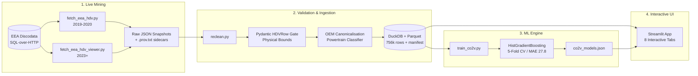

# 🚛 Competitive Powertrain Benchmarking Dashboard

EU heavy-duty vehicle (truck/bus) powertrain benchmarking and CO2 simulation platform — a demonstration project built on public EU regulator data.

[](tests/)
[](pyproject.toml)
[](powerbench/dataio.py)
[](app/streamlit_app.py)
[](https://mohamed-soubhi.github.io/Competitive-Powertrain-Benchmarking/)

---

## 🌐 Online Demo & Deployment

- **Interactive GitHub Pages App**: [https://mohamed-soubhi.github.io/Competitive-Powertrain-Benchmarking/](https://mohamed-soubhi.github.io/Competitive-Powertrain-Benchmarking/)
- **Technical HTML Documentation**: [https://mohamed-soubhi.github.io/Competitive-Powertrain-Benchmarking/documentation.html](https://mohamed-soubhi.github.io/Competitive-Powertrain-Benchmarking/documentation.html)
- **Presentation deck** (16 slides, keyboard / scroll): [https://mohamed-soubhi.github.io/Competitive-Powertrain-Benchmarking/presentation.html](https://mohamed-soubhi.github.io/Competitive-Powertrain-Benchmarking/presentation.html)
- **Streamlit Community Cloud**: Deploy directly via `app/streamlit_app.py` or test the full pipeline locally.

---

## 📋 System Architecture



---

## 🚀 Application Tabs & Features

| Tab | Purpose | Key Visualizations / Controls |
|---|---|---|
| **① Pipeline** | Live mining & dataset orchestration | Multi-year buttons, single-year mining, Discodata live stream, no-network reload, retrain |
| **② Overview** | High-level fleet composition | Fleet volume metrics, powertrain breakdown, OEM representation, filtered data preview |
| **③ Distributions** | Fleet parameter spread | Nested subtabs: **Overall** (stacked histograms) & **By manufacturer** (per-OEM box plots) |
| **④ Correlations** | Engineering trade-off analysis | Pearson heatmap (identifies negative link between engine size and brake specific CO2) |
| **⑤ Benchmark** | OEM competitive ranking | Box plots (median + IQR whiskers), multi-year trend lines, relative Δ % ranking |
| **⑥ ML** | CO2v predictive modeling & what-if | Out-of-fold scatter, permutation feature importance, interactive parameter sliders |
| **⑦ Documentation** | Regulatory & platform reference | Embedded rich HTML technical documentation + one-click offline HTML export |
| **⑧ Provenance** | Auditability & data lineage | Cryptographic SHA-256 manifest, source table references, rejection counters |

---

## 🛠️ Setup & Quickstart

Managed with [`uv`](https://github.com/astral-sh/uv) (fast Python package and project manager):

```bash
# 1. Clone repository
git clone https://github.com/mohamed-soubhi/Competitive-Powertrain-Benchmarking.git
cd Competitive-Powertrain-Benchmarking

# 2. Sync dependencies (runtime + dev + streamlit)
uv sync --group app --group dev

# 3. Run complete test suite (82 offline tests)
uv run pytest -v

# 4. Launch the Streamlit dashboard
uv run streamlit run app/streamlit_app.py
```

> **Switching between Windows and WSL?** A `.venv` built under one OS breaks `uv`
> on the other — it fails on the `lib64` symlink with *"failed to remove file
> `.venv\lib64`: Access is denied (os error 5)"*. Fix: delete the `.venv` folder
> (`rd /s /q .venv` on Windows, `rm -rf .venv` on WSL) and re-run `uv sync`. The
> `run_app.bat` / `run_app.sh` launchers do this automatically before starting the app.

---

## ⛏️ Data Mining & Pipeline Commands

```bash
# Dry run: Inspect generated T-SQL queries without sending network requests
uv run python 1-mining/fetch_eea_hdv.py --dry-run -v

# Mine 2019–2020 VECTO data from Discodata
uv run python 1-mining/fetch_eea_hdv.py

# Mine 2023 pre-joined viewer table
uv run python 1-mining/fetch_eea_hdv_viewer.py

# Validate raw snapshots and build DuckDB + Parquet store
uv run python 2-pipeline/reclean.py

# Train and honestly evaluate CO2v regression models (5-Fold CV)
uv run python 3-ml-prediction/train_co2v.py
```

### 🔄 Refreshing to the latest available data

The EEA publishes HDV CO2 monitoring on **annual reporting periods** (1 July –
30 June) with a ~9–12 month lag, so there is always a 1–2 year gap. As of this
release Discodata's `latest` alias exposes **2019, 2020** (`CO2_HeavyDutyVehicles`)
and **2023** (`HDV_2023_viewer`); 2021–2022 live only in the bulk CSV.

When a new year is published, pick it up like this:

```bash
# 1. Probe whether the year has landed (0 rows / error = not yet published)
curl -s "https://discodata.eea.europa.eu/sql?nrOfHits=1&query=SELECT%20COUNT(*)%20n%20FROM%20%5BCO2Emission%5D.%5Blatest%5D.%5BHDV_2024_viewer%5D"

# 2. Add the year to 1-mining/config/sources.yaml
#    eea_hdv_viewer:  years: [2023, 2024]        # viewer-style years (>= 2023)
#    eea_hdv_co2:      years: [2019, 2020, ...]   # only if the base table gains years

# 3. Mine just the new year (older snapshots stay on disk and are reused)
uv run python 1-mining/fetch_eea_hdv_viewer.py --years 2024

# 4. Re-validate + reload (merges every hdv_co2_*.json and hdv_viewer_*.json) and retrain
uv run python 2-pipeline/reclean.py
uv run python 3-ml-prediction/train_co2v.py
```

Or from the app: **Pipeline** tab → set the years → **Full: mine → load → train**.

- `reclean.py` always merges **all** raw snapshots in `1-mining/data/raw/`. To
  rebuild from scratch (drop stale years), delete `1-mining/data/raw/*.json` first.
- The manifest (`1-mining/data/cleaned/manifest.json`) records every source
  snapshot + its SHA-256, so the active dataset is always auditable.
- Newer reporting years use a newer VECTO version than 2019–2020 — treat
  cross-year `CO2v` comparisons as directional.

---

---

## 🧠 Machine Learning Architecture & Parameter Selection Case Study

> 📖 **Full Engineering Case Study**: Read the dedicated [ML Case Study & Parameter Selection Guide](docs/ml_case_study.html) for detailed physics derivations, validation scatter plots, and engineering trade-offs.

### 1. Problem Formulation & Objective
Running certified European Commission **VECTO** simulations for thousands of vehicle permutations requires confidential 3D CAD geometries, transmission efficiency loss maps, aerodynamic wind-tunnel drag coefficients ($C_d \cdot A$), and tyre rolling resistance maps. We train a high-speed non-linear surrogate model using **`HistGradientBoostingRegressor`** to estimate declared `CO2v` emissions ($g/km$) in sub-milliseconds from macro engineering specifications.

### 2. Target Leakage Guard (`assert_no_leakage`)
To ensure genuine predictive validity, downstream test cycle emissions and duplicate metrics are strictly banned from feature inputs:
- ❌ **`WHTC_CO2_gkwh` / `WHSC_CO2_gkwh`**: Engine dynamometer test results (g/kWh) directly feed the VECTO vehicle model. Using them would predict whole-vehicle CO2 from engine CO2.
- ❌ **`COL_CO2_gtkm` / `COL_FuelConsumption_l100km`**: Downstream mission profile outputs collinear with `CO2v`.
- ❌ **`MS_SpecificCO2Emissions`**: Downstream Member-State administrative registration numbers.

### 3. Algorithm Selection: Why `HistGradientBoostingRegressor`?
- **Non-Linear Interactions**: Aerodynamic drag scales quadratically ($v^2$), while engine brake-specific fuel consumption follows non-linear contour islands. Linear models achieve only $R^2 \approx 0.312$, whereas HistGradientBoosting achieves **$R^2 = 0.595 \pm 0.006$**.
- **Native Missing Value Handling**: Real-world regulatory filings have missing optional fields; HGB evaluates missingness at split time without ad-hoc imputation artifacts.
- **Fast $O(N \cdot K)$ Binning**: Continuous variables are binned into 256 integer bins, allowing tree evaluation in $<2\text{ ms}$ for real-time interactive What-If sliders.

### 4. Hyperparameter Rationale
- `max_iter = 300`: Allows gradient boosting to resolve fine-grained interaction terms (e.g. RPM $\times$ displacement) with early stopping.
- `learning_rate = 0.08`: Conservative shrinkage step size to prevent tree over-reaction to outlier chassis variants.
- `max_leaf_nodes = 31` ($2^5 - 1$): Constrains maximum tree depth to ~5 levels, capturing 3-to-4-way physical interactions (Mass $\times$ Displacement $\times$ Aerodynamic Group) without memorizing homologation codes.
- `random_state = 42`: Enforces exact reproducibility across cross-validation splits.

### 5. Empirical 5-Fold Cross-Validation Performance

| Model | Feature Set | CV R² | CV MAE (g/km) | Baseline MAE | Error Reduction |
|---|---|---|---|---|---|
| **HistGradientBoosting** | **Rich (2019–2020)** | **0.595 ± 0.006** | **27.8 g/km** | 49.4 g/km | **−43.7%** |
| Linear Regression | Rich (2019–2020) | 0.312 ± 0.008 | 39.6 g/km | 49.4 g/km | −19.8% |
| **HistGradientBoosting** | **Base (All Years)** | **0.448 ± 0.018** | **45.2 g/km** | 62.2 g/km | **−27.3%** |
| Linear Regression | Base (All Years) | 0.245 ± 0.012 | 54.1 g/km | 62.2 g/km | −13.0% |

### 6. Feature Importance & Physical Interpretation
1. **`VehicleGroup` (~59.9% importance)**: Sets the baseline aerodynamic drag area ($C_d \cdot A$), axle count, and standard VECTO duty cycle weighting (Group 4 rigid vs Group 5 long-haul tractor).
2. **`CurbMassChassis_kg` (~42.7% importance)**: Directly dictates baseline rolling resistance force ($F_{\text{roll}} = C_{rr} \cdot m \cdot g$) and acceleration inertia.
3. **`Engine_Displacement_ltr` (~24.9% importance)**: Dictates swept volume, friction scaling, and thermodynamic peak efficiency contours.
4. **`Engine_RatedPower_kw` (~23.2% importance)**: Governs gradient climbing speed and highway cruising load points.
5. **`Engine_RatedSpeed_rpm` (~8.4% importance)**: Captures manufacturer *downspeeding* philosophy (e.g. 1600 RPM vs 2200 RPM lowers parasitic friction).

### 7. Extrapolation Envelope Guard
Gradient boosted decision trees cannot extrapolate trends outside their training bounds. The pipeline records $p_1$ and $p_{99}$ percentile boundaries (e.g. Curb Mass $5,566\text{–}9,563\text{ kg}$, Displacement $6.7\text{–}16.4\text{ L}$) to warn users in the **What-If Simulator** whenever inputs lie outside empirical confidence bounds.

---

## 📜 Regulatory Reference

- **Euro VI Engine Approval (Reg. 595/2009)**: `WHTC` (transient dynamometer cycle) and `WHSC` (13 steady-state modes) measure brake-specific engine efficiency in `g/kWh`.
- **HDV CO2 Monitoring (Reg. (EU) 2018/956)**: Mandates whole-vehicle simulation in `VECTO` to determine declared `CO2v` in `g/km`.
- **Transport Freight Efficiency**: `COL_CO2_gtkm` measures grams of CO2 per metric tonne of freight hauled per kilometer ($g/t\cdot km$).

---

## 🧪 Test Suite

All 76 unit tests run completely offline with no network dependencies:

```bash
uv run pytest -q
```
